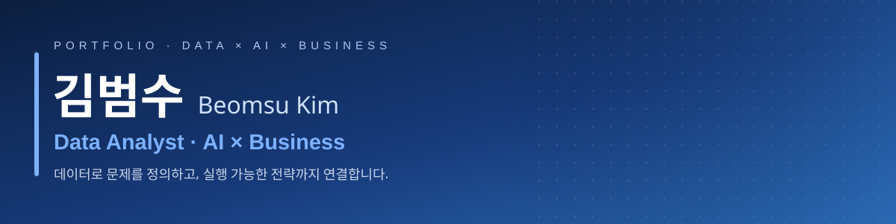

  

 

## 👋 About

데이터 분석을 축으로 **AI 활용**과 **비즈니스 기획**으로 폭을 넓히는 실행형 분석가입니다.
금융 결제 데이터 분석부터 AI 에이전트 개발, 실제 사업화까지 — 분석이 리포트에서 끝나지 않고 **의사결정과 매출로 이어지는 경험**을 공모전·창업·산학에서 반복해 왔습니다.

- 🧩 **문제 정의** — `5WHY · MECE`로 진짜 문제를 좁히고 지표를 설계
- 📊 **분석** — `SQL · Python`으로 수집 → 전처리(JOIN) → EDA → 인사이트 → 시각화
- 🤖 **AI 활용** — `LangChain · LangGraph · RAG` 기반 에이전트를 직접 설계·개발
- ⚙️ **자동화** — 반복 데이터 업무를 `Playwright` RPA로 개선 (연세대 심리학부 RA)

🎓 가천대학교 인공지능전공 · 창업학 융합전공

## 🛠️ Tech Stack

| | |
|:--|:--|
| **Data** |      |
| **AI / LLM** |      |
| **Viz / BI** |    |
| **Engineering** |     |

## 📂 Selected Work

| 프로젝트 | 소개 | 스택 |
|:--|:--|:--|
| **[솔비(SOL-B) · 신한카드 빅콘테스트](https://github.com/AISWKimBeomSu/shcard_2025_bigcontest)** [▶ Live Demo](https://momentum3bigcontest.streamlit.app) | 실 가맹점 결제 데이터를 JOIN·전처리·분석해 소상공인 맞춤 마케팅 전략을 답하는 LangGraph RAG 에이전트 | `Python` `SQL` `LangGraph` `RAG` `Streamlit` |
| **연구실 데이터 입력 자동화 (RA)** &nbsp;`비공개` | 24시간 회상법 식이 데이터 전처리·입력을 Playwright로 자동화한 RPA 파이프라인 · 연세대 심리학부 | `Python` `Playwright` `pandas` |
| **[서울 이모삼촌](https://github.com/AISWKimBeomSu/seoul-imosamchon)** | 시니어(5060+) 모집 브랜드 웹 · 서울시 50플러스재단 **사업화 협약** | `Next.js` `TypeScript` `Supabase` |
| **[PULSEFALL](https://github.com/AISWKimBeomSu/pulsefall)** [▶ Live Demo](https://aiswkimbeomsu.github.io/pulsefall/) | 의존성 0·에셋 0으로 만든 리듬 반사 아케이드 · NHN NAN 2026 | `JavaScript` `Canvas` |
| **[AI Safe Walking Assistant](https://github.com/AISWKimBeomSu/WalkingAssistant)** | 시각장애인 보행 내비 엔진 — 방위각 보정 · 2m 단위 경로 이탈 감지 | `Kotlin` `T-map API` |
